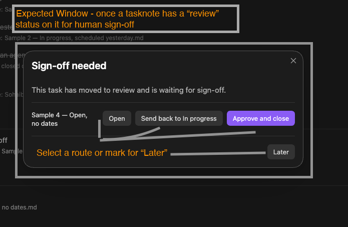

# Sheiko Task Lifecycle

An Obsidian plugin that works **alongside [TaskNotes](https://github.com/callumalpass/tasknotes)** to add task-lifecycle tracking and a daily auto-roll for unfinished tasks.

> **Status: early release (v0.1.0), desktop only.** Plugin ID `sheiko-task-lifecycle`. Tested against TaskNotes **4.13.4**. Submitted to the [Obsidian Community directory](https://community.obsidian.md/plugins/sheiko-task-lifecycle) (review pending).

*Click the ribbon icon (history clock) on a TaskNotes task to open the lifecycle window. Screenshots are from the developer's test vault: sample task names are test data and may not match the task's current status, and some settings differ from the defaults below.*

## Before you start: what Sheiko changes in your vault

Sheiko edits your notes, so it starts switched off and stays cautious:

- **It does nothing unless TaskNotes is installed and enabled.** No tracking, no auto-roll, no prompts. If you enable TaskNotes later, reload Obsidian.
- **It writes nothing until you allow the current vault** (Settings → Sheiko Task Lifecycle → Safety → *Allow writes in this vault*). Until then it's read-only.
- **Auto-roll is off by default.** Turn on *Dry run* first to see what it would change, then switch auto-roll on. Dry-run output goes to the developer console (Ctrl/Cmd+Shift+I) at the *Verbose* log level.
- **Each batch run is capped** at 25 edited notes by default (*Max edits per run*). The rest are picked up on the next run.

Once allowed, it writes to **task notes** (frontmatter: `completedDate`, `closedBy`, `timeToCloseMinutes`, `timeWorkingMinutes`, `timeOvernightMinutes`, `timeWeekendMinutes`, `closureSource`, `scheduled`, `rollCount`, `status`; sections: `## Context`, `## Status History`, `## Lifecycle Summary`) and, when auto-roll runs, to **that day's daily note** (`## 🔁 Rolled Over`, creating the note if it doesn't exist). It never sends data anywhere: no network use, no telemetry.

## Getting started

1. Install and enable [TaskNotes](https://github.com/callumalpass/tasknotes), then this plugin.
2. In this plugin's settings, switch on **Allow writes in this vault**.
3. Optional: enter **Your identity**. It's written as `closedBy` on closes Sheiko records. Left blank, `closedBy` isn't written.
4. Optional, for the sign-off flow: add a review status (e.g. `in-review`) in TaskNotes' settings, then pick it as **Review status** here. Until a review status is picked, the checkbox move and both sign-off prompts stay off.
5. Optional: set your **working hours**, try **Dry run**, then switch on **auto-roll**.

## What it does

### 1. Task lifecycle (Phase 1)

- **Context log.** An append-only `## Context` section in each task note, with entries formatted `- **{timestamp} — {who}:** {text}` (`— {who}` is left out when no identity is set).
- **Status history.** An append-only `## Status History` section with ISO-timestamped transitions. Clicking the same status again isn't logged.
- **Closure fields.** `completedDate` (full ISO), `closedBy` (only if an identity is set) and `timeToCloseMinutes` are written **only for a close Sheiko saw happen live**. Sheiko never overwrites a close written by hand or by another tool. Closes it recorded are marked `closureSource: sheiko`, and a reopen clears only those.
- **Time per status, in three buckets.** Time is split into working hours, overnight and weekend, written as `timeWorkingMinutes`, `timeOvernightMinutes` and `timeWeekendMinutes`. The three always add up to `timeToCloseMinutes`.
- **Lifecycle Summary.** A `## Lifecycle Summary` section (closure plus time per status), refreshed in place. It's written automatically on a live close, or on demand.
- **Startup catch-up.** Status changes made while Obsidian was closed are logged as "detected at startup", never given an invented time. Time spent in a status that was skipped over is shown as a **gap**, not estimated. Closes Sheiko didn't see happen are listed and flagged, never filled in.

### 2. Auto-stage and sign-off (Phase 2)

- **Auto-stage (forward only).** Starting a TaskNotes timer moves the task to the working status. Ticking the last unticked checkbox moves it to the review status. Moves happen only when something changes, never just because of existing state, and never backwards or out of a completed status.
- **Sign-off prompt.** Opens when a task enters review, and at each day's end time for anything still waiting. Buttons: *Approve and close*, *Send back*, *Open*, *Later*. **Closing a task is always a user click, never automatic.**

### 3. Auto-roll and summary (Phase 3)

- At each day's end time (**weekends included**), unfinished tasks scheduled on or before that day have `scheduled` moved to the next day. A time of day, if present, is kept. **`due` never changes**, so slippage stays visible. `rollCount` goes up by one each time.
- **Not rolled:** completed, scheduled in the future, recurring (TaskNotes uses `scheduled` as the repeat anchor), and archived tasks. Tasks with **no date** are listed as "give these a date".
- **Summary, in two places:** a Context line on each rolled task, and a `## 🔁 Rolled Over` section in that day's daily note (one block per run, never overwritten). In-review tasks are listed first (⭐), and past-due tasks are flagged ⚠️.
- If Obsidian was closed at the cutoff, one **catch-up** roll runs on next open, labelled as a catch-up.

## Commands

- Open task lifecycle (context, closure, time per status). Also opened from the ribbon icon.
- Write lifecycle summary to this task
- Show tasks waiting for sign-off
- Roll unfinished tasks now (scheduled today or earlier → tomorrow)
- List tasks closed while Obsidian was shut

The ribbon icon and the lifecycle command need a TaskNotes task open. On any other note you get a notice instead:

## Settings

| Setting | Default | Notes |
|---|---|---|
| Identity | *(blank)* | Written as `closedBy` and in Context entries. Blank = no `closedBy`. |
| Working hours (per weekday) | 09:00–17:00, every day | The end time is also the daily roll cutoff. The same window decides the working / overnight / weekend split. |
| Allowed vaults | *(empty)* | **Nothing is written until the current vault is allowed.** |
| Dry run | off | Logs intended writes instead of making them, including the daily note |
| Max edits per run | 25 | Caps startup catch-up and auto-roll. Tasks held back are listed and picked up on the next run. |
| Working / review / done status | `in-progress` / *(not set)* / `done` | Picked from TaskNotes' own status list. While review is not set, the checkbox move and both sign-off prompts are off. |
| Auto-stage on timer start / all boxes ticked | on / on | Each can be switched off |
| Sign-off prompt on review / at cutoff | on / on | Each can be switched off |
| Auto-roll | off | Try dry run first |

Statuses and field names are read from TaskNotes' settings rather than hardcoded. TaskNotes' default statuses don't include a review status, so add one in TaskNotes first if you want the sign-off flow.

  
  

## Requirements

- Obsidian **1.4.4+**, desktop only
- **TaskNotes** installed and enabled (tested on 4.13.4)
- Obsidian's Daily Notes settings (folder and date format) are used for the Rolled Over summary

## Compatibility

- **TaskNotes Workflows:** its optional *scheduled-date rollover* workflow and Sheiko's auto-roll both move `scheduled` forward. Use one or the other, not both, or tasks will move twice.

## Known limits

- A task first seen by Sheiko has no earlier history. It's tracked from then on, with nothing backfilled.
- If a close written by an agent or by hand is reopened and then closed again live, the original `closedBy` / `timeToCloseMinutes` are kept, so they can be stale.
- Sheiko waits 600 ms after a change so TaskNotes can finish its own writes. That delay is a timing assumption.
- Tested only against TaskNotes 4.13.4. A change to TaskNotes' frontmatter or settings shape could break Sheiko.
- If a task's only recorded status change is the close itself, the Lifecycle Summary's *Time per status* table has no rows.
- Settings don't yet appear in Obsidian 1.13's settings search.

## Support

Best effort. Report issues on [GitHub](https://github.com/Ashura-Sheikh/Sheiko-obsidian-plugin/issues). No response-time guarantee. Tested on TaskNotes 4.13.4.

## Development

- Node.js 20+
- `npm i` to install dependencies
- `npm run dev` to build in watch mode (`src/main.ts` → `main.js`)
- `npm run build` to type-check and run a production build
- `npm run lint` for ESLint with the Obsidian plugin rules
- `npm test` to type-check and run the tests

**Loading it in a dev vault:** symlink the repo into the vault as `<vault>/.obsidian/plugins/sheiko-task-lifecycle → <repo>` (the folder name must match the plugin ID), then enable "Sheiko Task Lifecycle" under Community plugins. To install manually instead, copy `main.js`, `manifest.json` and `styles.css` into `<vault>/.obsidian/plugins/sheiko-task-lifecycle/`.

**Naming note:** class names, CSS classes, notices ("Sheiko: …") and the `closureSource: sheiko` value written to task notes deliberately keep the short name "Sheiko". Changing `closureSource` would stop a reopen from clearing closure fields on tasks Sheiko had already closed.

**Source layout (`src/`):** `main.ts` (plugin entry, commands, cutoff timer), `tracker.ts` (status-change detection, closure, startup catch-up), `lifecycle.ts` (history, time buckets, summary), `roll.ts` / `roller.ts` (auto-roll rules and engine), `tasknotes.ts` (reading TaskNotes' config), `settings.ts`, `ui/` (lifecycle and sign-off windows).

**Tests (`test/`):** 25 tests run the real tracker and auto-roll code against an in-memory vault and a stand-in for the `obsidian` module (`test/obsidian-mock.ts`). They cover the code that edits notes: closure fields, reopen, startup catch-up, dry run, the edit limit, and what does and doesn't roll. The repo's build workflow (`.github/workflows/lint.yml`) also runs them.

## Licence

[MIT](LICENSE) © 2026 Sheikh M Sahil

## Credits

Built from the [Obsidian sample plugin](https://github.com/obsidianmd/obsidian-sample-plugin) template. API docs: https://docs.obsidian.md
